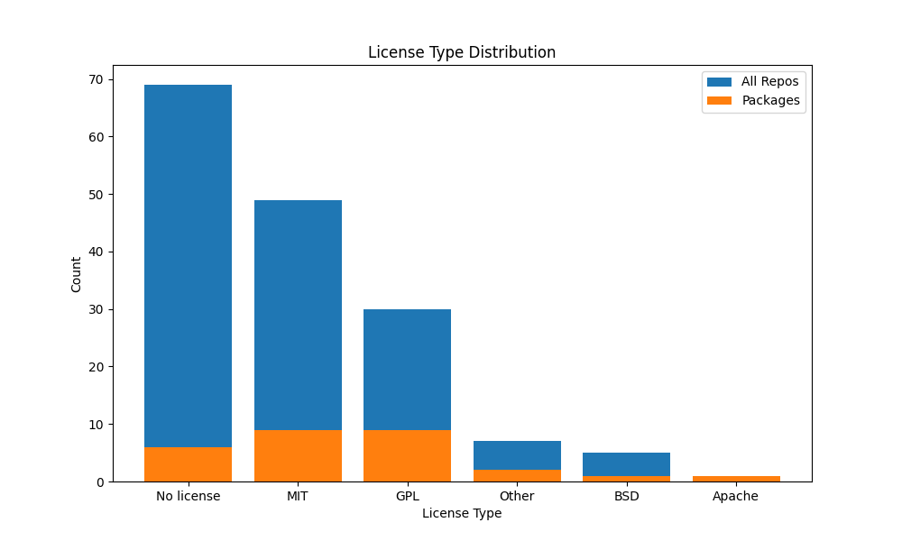

# Primer3 dependents license analysis

This repository contains the code used to analyze the license of the dependents of [primer3-py](https://github.com/libnano/primer3-py).

## Installation

```bash
# Create virtual environment
python -m venv .venv

# Activate virtual environment
source .venv/bin/activate

# Install dependencies
pip install -r requirements.txt
```

## Using GitHub API

To use the GitHub API, you need to set the `GITHUB_TOKEN` environment variable. You can get a token from [here](https://github.com/settings/tokens).

Then:
```bash
export GITHUB_TOKEN=<your_token>
```

## Input files

The input files are manually retrieved from the [primer3-py dependents page](https://github.com/libnano/primer3-py/network/dependents).

- `packages.txt`: A list of package names from pypi that depend on primer3-py.
- `dependents.txt`: A list of repository names that depend on primer3-py.

## Usage

```bash
# Get the licenses of the dependent repositories
python get_licenses.py

# Make a dataset showing the package name, license and if it's a package or not
python make_final_dataset.py

# Plot the results
python plot_results.py
```

## Result

What we can see by running plot_results is that:

* Out of 161 dependent repositories, 30 use a GPL license
* Out of 28 dependent packages, 9 use a GPL license

A distribution is shown below:


